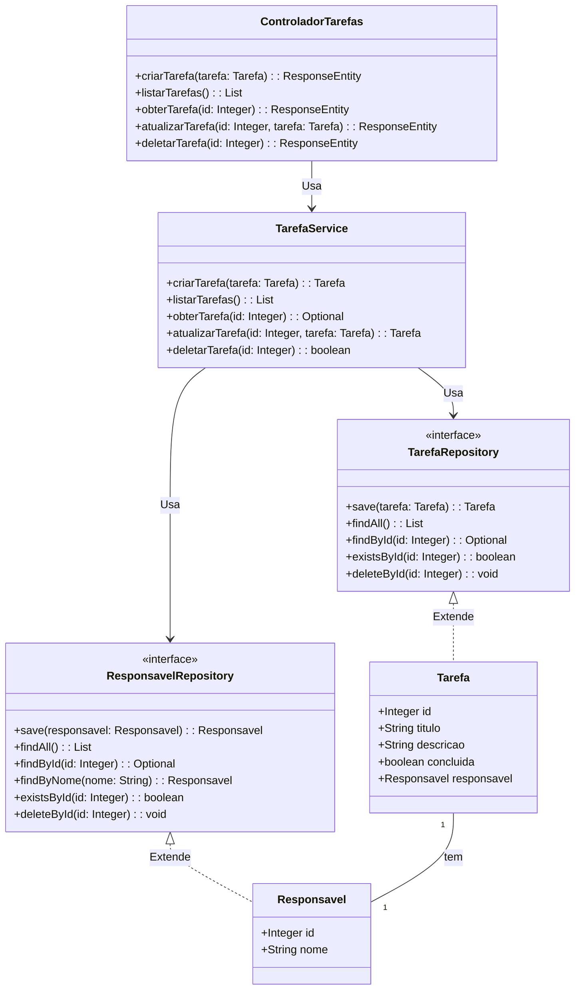

# Projeto Desenvolvido no Bootcamp Santander

## DIAGRAMA DE CLASSES

```mermaid

classDiagram
    class Tarefa {
        +Integer id
        +String titulo
        +String descricao
        +boolean concluida
        +Responsavel responsavel
    }

    class Responsavel {
        +Integer id
        +String nome
    }

    class TarefaRepository {
        <<interface>>
        +save(tarefa: Tarefa): Tarefa
        +findAll(): List<Tarefa>
        +findById(id: Integer): Optional<Tarefa>
        +existsById(id: Integer): boolean
        +deleteById(id: Integer): void
    }

    class ResponsavelRepository {
        <<interface>>
        +save(responsavel: Responsavel): Responsavel
        +findAll(): List<Responsavel>
        +findById(id: Integer): Optional<Responsavel>
        +findByNome(nome: String): Responsavel
        +existsById(id: Integer): boolean
        +deleteById(id: Integer): void
    }

    class TarefaService {
        +criarTarefa(tarefa: Tarefa): Tarefa
        +listarTarefas(): List<Tarefa>
        +obterTarefa(id: Integer): Optional<Tarefa>
        +atualizarTarefa(id: Integer, tarefa: Tarefa): Tarefa
        +deletarTarefa(id: Integer): boolean
    }

    class ControladorTarefas {
        +criarTarefa(tarefa: Tarefa): ResponseEntity<Tarefa>
        +listarTarefas(): List<Tarefa>
        +obterTarefa(id: Integer): ResponseEntity<Tarefa>
        +atualizarTarefa(id: Integer, tarefa: Tarefa): ResponseEntity<Tarefa>
        +deletarTarefa(id: Integer): ResponseEntity<Void>
    }

    TarefaService --> TarefaRepository : Usa
    TarefaService --> ResponsavelRepository : Usa
    ControladorTarefas --> TarefaService : Usa
    ResponsavelRepository <|.. Responsavel : Extende
    TarefaRepository <|.. Tarefa : Extende

    Tarefa "1" -- "1" Responsavel : tem
```
